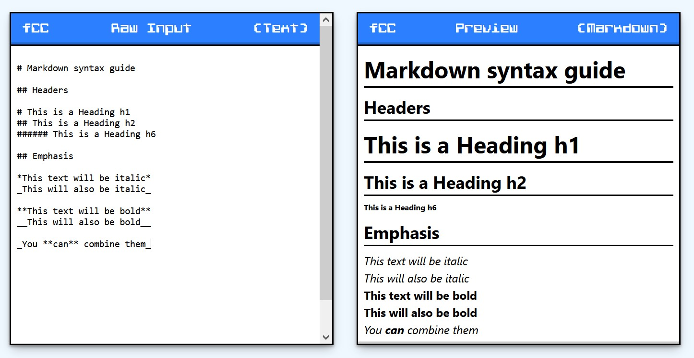

# freeCodeCamp Markdown Previewer

Submission for freeCodeCamp's "Front End Development Libraries" course.

To see the tests passing, open the testing widget in the upper-left corner, select "Markdown Previewer" from the dropdown, and then click the "Run Tests" button.

> Note that this project does not currently pass the optional 8th test.

This project uses [Marked](https://marked.js.org/) for parsing markdown into HTML.

